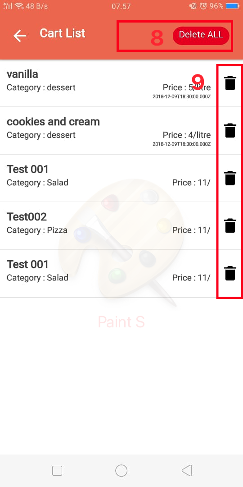

# Ubux Store

## Introduction

This is a simple full stack Mobile application which provides a solid starting point for [React Native](https://facebook.github.io/react-native) mobile applications.

## Before You Begin

Before you begin i recommend you to read about the basic building blocks that assemble this application:
* React Native - Start by going through [React Native Official Website](https://facebook.github.io/react-native) is a great starting point.
* Node.js - Start by going through [Node.js Official Website](https://nodejs.org/en/) which should get you going with the Node.js platform.

## Prerequisites

Make sure you have installed all of the following prerequisites on your development machine:
* Git - [Download & Install Git](https://git-scm.com/downloads). OSX and Linux machines typically have this already installed.
* Node.js - [Download & Install Node.js](https://nodejs.org/en/download/) and the npm package manager.
* React Native - [Install React Native](https://facebook.github.io/react-native/docs/getting-started)

## Technology stack

 - react-native (0.57)
 - react-navigation
 - react-redux
 - redux
 - redux-saga
 - redux-persist
 - native-base

## Quick Start

open terminal to run app,

```bash
# Clone the repository
git clone https://github.com/rekysenjaya/ubuxstore

# Go inside the directory
cd ubuxstore

# Install dependencies
npm install

# To run your app on iOS:

react-native run-ios
   - or -
Open ios/ubux_store.xcodeproj in Xcode
Hit the Run button

# To run your app on Android:

Have an Android emulator running (quickest way to get started), or a device connected

react-native run-android
```
## Unit Test with Jest And linting standards with ESLint

open terminal to run,

```bash
# Go inside the directory
cd ubuxstore

# and run unit test with jest
npm test

# and run linting standards with ESLint
npm run lint
```


## User Guide




Steps to use the application Ubux Store
 1. store list, you can choose a store just by clicking
 2. search input text, to find the name of the store you are looking for
 3. to choose the status of the store you are looking for
 4. You can see the list of items that you have selected in the store product list
 5. to see the store's products, you have to click this
 6. You can choose a store product, just press this icon
 7. and you can see the number of items you selected, and can enter the item list page that you selected
 8. You don't need long to delete all the items you choose, by pressing this button
 9. or you can delete, one by one

## For APK files, you can download the APK file in the folder `./APK` 